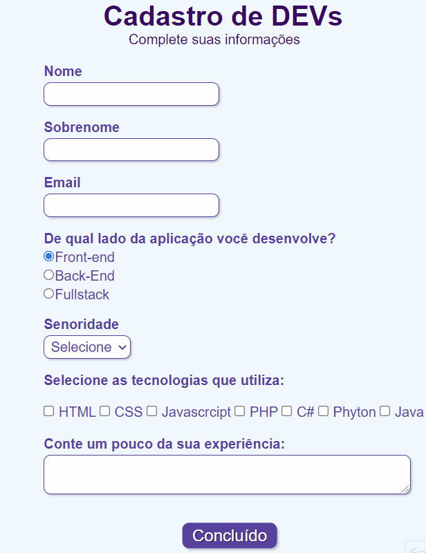

# Formulário 🗹🗹🗹

> Projeto com HTML e CSS |  

### Descrição

> Objetivos de aprendizagem:

- Desenvolver um formulário simples.
- Conhecimentos aplicados de HTML e CSS.

> Demonstração

<h1 align="center">

</h1>
